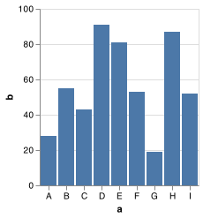
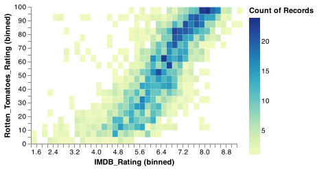

## Description

An assortment of handy [Babashka](https://github.com/borkdude/babashka) CLIs

## Setup

First, [install babashka](https://github.com/borkdude/babashka#installation).
These scripts require babashka >= 0.0.91.

To setup using and modifying these scripts, read the [General section](#general). To just install one script, read the [Single Script section](#single-script). To setup babashka as I use it, read the [bb section](#bb).

### General
Setup your $PATH and $BABASHKA_CLASSPATH:
```sh
$ git clone https://github.com/cldwalker/bb-clis
$ cd bb-clis

$ export PATH=$PATH:$HOME/path/to/bb-clis/bin

# To be able to use the scripts outside of this repository
$ export BABASHKA_CLASSPATH=$BABASHKA_CLASSPATH:$HOME/path/to/bb-clis/src
```

#### Script Dependencies

If a script depends on an external library, add them to $BABASHKA_CLASSPATH:

```sh
$ export BABASHKA_CLASSPATH=$BABASHKA_CLASSPATH:$(clojure -Spath -Sdeps "$(cat $HOME/path/to/bb-clis/deps.edn)")
```


### Single Script

To use a single babashka script without the General setup, simply export one using --uberscript:
```sh
# -f can be any of my babashka scripts that don't have options
$ bb -f bb-github-repo --uberscript my-bb-github-repo.clj

# To run the exported script
$ bb -f my-bb-github-repo.clj

# Optionally, use https://github.com/borkdude/carve to delete unused code
$ clojure -A:carve --opts '{:paths ["my-bb-github-repo.clj"] :interactive? false}'
```

### bb

The previous sections are about setting up your environment to run the scripts in this repository. This section is about running babashka on the commandline. This section assumes you've setup `$BABASHKA_CLASSPATH` as mentioned above.

Babashka supports `$BABASHA_PRELOADS` which allows arbitrary clojure to be run at the start of each invocation. This is handy for loading one's preferred set of vars and namespaces. To avoid loading [preloads](preloads.clj) when running babashka scripts but load them for commandline babashka, use this alias: `alias bb="BABASHKA_PRELOADS='(load-file (str (System/getenv \"HOME\") \"/path/to/this-repo/preloads.clj\"))' bb"`

Preloaded fns like `map-keys` are then available on the commandline:

```sh
# Prints out env variables map with env keys converted to clojure-cased keywords
$ bb '(->> (System/getenv) (into {}) (map-keys #(-> % (str/replace "_" "-") str/lower-case keyword)))'
{:gopath "/Users/me/.go", :path ...}
```

## CLIs

The following CLIs are under bin/:

* [bb-github-pr-for-commit](#bb-github-pr-for-commit)
* [bb-github-repo](#bb-github-repo)
* [bb-grep-result-frequencies](#bb-grep-result-frequencies)
* [bb-update-lein-dependency](#bb-update-lein-dependency)
* [bb-table](#bb-table)
* [bb-project-clj](#bb-project-clj)
* [bb-replace](#bb-replace)
* [bb-vis](#bb-vis)

### bb-github-pr-for-commit

Prints github url of PR associated with a commit. It assumes a current directory's repository but any repository can be specified. See https://github.com/mislav/hub-api-utils/blob/master/bin/hub-pr-with-commit for an alternative implementation.

#### Setup

* Install [clj-http-lite](https://github.com/borkdude/clj-http-lite) using [above instructions](#script-dependencies)
* Optional: To have this executable with private repositories, set `$GITHUB_USER` to your user and [create and set a $GITHUB_OAUTH_TOKEN](https://developer.github.com/apps/building-oauth-apps/authorizing-oauth-apps/#non-web-application-flow)

#### Usage

```sh
# Prints url and opens url for osx
$ ./bb-github-pr-for-commit -r atom/atom 0f521f1e8afbcaf73479ea93dd4c87d9187903cb
"https://github.com/atom/atom/pull/20350"

# Open url of current github repository
$ ./bb-github-pr-for-commit SHA
```

### bb-github-repo

For the current github repo, open different repo urls e.g. commit or branch. Inspired by [this ruby version](https://github.com/cldwalker/irbfiles/blob/1fb97d84bcdf491325176d08e386468b12ece738/boson/commands/public/url/github.rb#L20-L50).

To open a commit, `bb-github-repo -c SHA`.

### bb-grep-result-frequencies

For use with grep command to group results by frequency e.g. `git grep protocol | bb-group-grep-results`.

### bb-update-lein-dependency

Updates lein dependency of specified directories and optionally commits and pushes the change. For example, if I'm in the dependency's directory and I want to update two dependent projects to use its latest SHA, commit and git push:

`bb-update-lein-dependency -c -d ../proj1 -d ../proj2 my-dep $(git rev-parse HEAD)`.

### bb-table

#### Optional Setup

By default, this script prints with `clojure.pprint/print-table`. To print with a table that has more features and a more useful default, pull in the [table clojar](https://github.com/cldwalker/table) using the [above instructions](#script-dependencies).

#### Usage
Prints an ascii table given an EDN collection on stdin or as a file:

```sh
$ echo '[{:a 4 :b 2} {:a 2 :c 3}]' | bb-table

| :a | :b | :c |
|----+----+----|
|  4 |  2 |    |
|  2 |    |  3 |

$ bb-table -f something.edn
...
```

### bb-project-clj
Prints a project.clj defproject form as a map. Useful for manipulating this data on the commandline

```sh
# Pretty prints a project's dependencies
$ bb-project-clj -d 1 | bb -I '(-> *input* first :dependencies clojure.pprint/pprint)'
```

### bb-replace
Replaces a substring in a file using a regex to match it. Much less powerful
than sed but more user friendly as it supports configuring and naming regexs.
bb-replace reads configs found in ~/.bb-replace.edn and ./bb-replace.edn. See
script for documentation on config format.

```sh
# Use the default name replacements provided
$ cp .bb-replace.edn ~/.bb-replace.edn

# Navigate to a lein project and update project's version
$ bb-replace lein-version 1.2.1

# Navigate to a nodejs project and update project's version
$ bb-replace node-version 2.1.1

# A one-off regex can be used. This updates a map entry to false
$ bb-replace -f project.clj -F '$1 %s' "(:pseudo-names)\s+\w+" false
```

## bb-vis
Generates [vega-lite](https://vega.github.io/vega-lite/) visualizations given vega-lite data as a file or on stdin. Data file can be json or edn.

### Setup
Install vega-lite cmds with `yarn global add vega-lite`.

### Usage

Assume you have the following bar.edn:

```clj
{:data
  {:values
   [{:a "A", :b 28}
    {:a "B", :b 55}
    {:a "C", :b 43}
    {:a "D", :b 91}
    {:a "E", :b 81}
    {:a "F", :b 53}
    {:a "G", :b 19}
    {:a "H", :b 87}
    {:a "I", :b 52}]},
  :mark "bar",
  :encoding
  {:x {:field "a", :type "ordinal", :axis {:labelAngle 0}},
   :y {:field "b", :type "quantitative"}}}
```

To generate this image and open it: `bb-vis bar.edn -o`.

To generate this image as a pdf and open it: `bb-vis bar.edn -F pdf -o`

Generated image:



Any of the [official examples](https://vega.github.io/vega-lite/examples/) can be generated by simply copying and pasting the data to stdin. For example, let's try the 2D histogram heatmap:

```sh
cat <<EOF | bb-vis -o
{
  "$schema": "https://vega.github.io/schema/vega-lite/v4.json",
  "data": {"url": "data/movies.json"},
  "transform": [{
    "filter": {"and": [
      {"field": "IMDB_Rating", "valid": true},
      {"field": "Rotten_Tomatoes_Rating", "valid": true}
    ]}
  }],
  "mark": "rect",
  "width": 300,
  "height": 200,
  "encoding": {
    "x": {
      "bin": {"maxbins":60},
      "field": "IMDB_Rating",
      "type": "quantitative"
    },
    "y": {
      "bin": {"maxbins": 40},
      "field": "Rotten_Tomatoes_Rating",
      "type": "quantitative"
    },
    "color": {
      "aggregate": "count",
      "type": "quantitative"
    }
  },
  "config": {
    "view": {
      "stroke": "transparent"
    }
  }
}
EOF
```

Generated image:



## License
See LICENSE.md

## Additional Links

* For more bb setup and aliases, see [my dotfiles repo](https://github.com/cldwalker/dotfiles/search?q=bb&unscoped_q=bb)
* See https://github.com/borkdude/babashka/blob/master/doc/examples.md for additional babashka cmd examples
